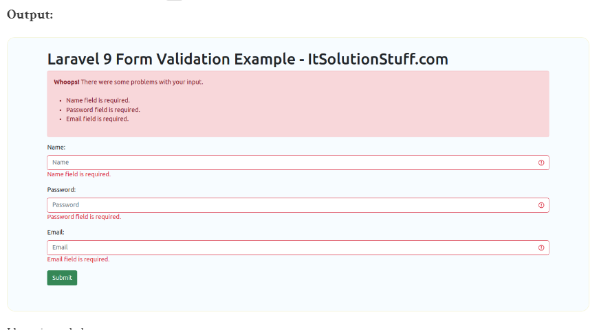

# laravel9_form_validation
## 1. Laravel 9 Form Validation
- Tạo mới một project laravel;

```Dockerfile
composer create-project laravel/laravel laravel9_form_validation
```
- Tạo một database tên: laravel9_form_validation 
## 2. Create Controller

```Dockerfile
php artisan make:controller FormController
```

- Vào app/Http/Controllers/FormController.php

```Dockerfile
<?php
  
namespace App\Http\Controllers;
  
use Illuminate\Http\Request;
use App\Models\User;
  
class FormController extends Controller
{
    /**
     * Show the application dashboard.
     *
     * @return \Illuminate\Http\Response
     */
    public function create()
    {
        return view('createUser');
    }
      
    /**
     * Show the application dashboard.
     *
     * @return \Illuminate\Http\Response
     */
    public function store(Request $request)
    {
  
        $validatedData = $request->validate([
                'name' => 'required',
                'password' => 'required|min:5',
                'email' => 'required|email|unique:users'
            ], [
                'name.required' => 'Name field is required.',
                'password.required' => 'Password field is required.',
                'email.required' => 'Email field is required.',
                'email.email' => 'Email field must be email address.'
            ]);
    
        $validatedData['password'] = bcrypt($validatedData['password']);
        $user = User::create($validatedData);
          
        return back()->with('success', 'User created successfully.');
    }
}
```

## 3. Create Routes
- Vào routes/web.php

```Dockerfile
<?php
  
use Illuminate\Support\Facades\Route;
  
use App\Http\Controllers\FormController;
  
/* 
|--------------------------------------------------------------------------
| Web Routes
|--------------------------------------------------------------------------
|
| Here is where you can register web routes for your application. These
| routes are loaded by the RouteServiceProvider within a group which
| contains the "web" middleware group. Now create something great!
|
*/
  
Route::get('user/create', [ FormController::class, 'create' ]);
Route::post('user/create', [ FormController::class, 'store' ]);
```
## 4.  Create Blade File
- Vào resources/views tạo file createUser.blade.php

```Dockerfile
<!DOCTYPE html>
<html>
<head>
    <title>Laravel 9 Form Validation Example - ItSolutionStuff.com</title>
    <meta charset="utf-8">
    <meta http-equiv="X-UA-Compatible" content="IE=edge">
    <meta name="viewport" content="width=device-width, initial-scale=1">
    <link href="https://cdn.jsdelivr.net/npm/bootstrap@5.0.2/dist/css/bootstrap.min.css" rel="stylesheet">
</head>
<body>
    <div class="container">
    
        <h1>Laravel 9 Form Validation Example - ItSolutionStuff.com</h1>
       
        @if(Session::has('success'))
        <div class="alert alert-success">
            {{ Session::get('success') }}
            @php
                Session::forget('success');
            @endphp
        </div>
        @endif
    
        <!-- Way 1: Display All Error Messages -->
        @if ($errors->any())
            <div class="alert alert-danger">
                <strong>Whoops!</strong> There were some problems with your input.<br><br>
                <ul>
                    @foreach ($errors->all() as $error)
                        <li>{{ $error }}</li>
                    @endforeach
                </ul>
            </div>
        @endif
       
        <form method="POST" action="{{ url('user/create') }}">
      
            {{ csrf_field() }}
      
            <div class="mb-3">
                <label class="form-label" for="inputName">Name:</label>
                <input 
                    type="text" 
                    name="name" 
                    id="inputName"
                    class="form-control @error('name') is-invalid @enderror" 
                    placeholder="Name">
  
                <!-- Way 2: Display Error Message -->
                @error('name')
                    <span class="text-danger">{{ $message }}</span>
                @enderror
            </div>
     
            <div class="mb-3">
                <label class="form-label" for="inputPassword">Password:</label>
                <input 
                    type="password" 
                    name="password" 
                    id="inputPassword"
                    class="form-control @error('password') is-invalid @enderror" 
                    placeholder="Password">
  
                <!-- Way 3: Display Error Message -->
                @if ($errors->has('password'))
                    <span class="text-danger">{{ $errors->first('password') }}</span>
                @endif
            </div>
       
            <div class="mb-3">
                <label class="form-label" for="inputEmail">Email:</label>
                <input 
                    type="text" 
                    name="email" 
                    id="inputEmail"
                    class="form-control @error('email') is-invalid @enderror" 
                    placeholder="Email">
  
                @error('email')
                    <span class="text-danger">{{ $message }}</span>
                @endif
            </div>
     
            <div class="mb-3">
                <button class="btn btn-success btn-submit">Submit</button>
            </div>
        </form>
    </div>
</body>
</html>
```
## 5. Chạy project

```Dockerfile
php artisan serve
```
-  Vào 
http://localhost:8000/user/create


